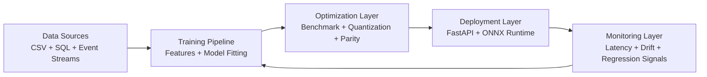

This portfolio demonstrates a production-grade ML systems workflow designed for reproducibility, portability, and operational observability.

## Lifecycle Overview

The system follows a 5-stage ML lifecycle:



<Note>
  The feedback loop from monitoring to training enables data-driven retraining decisions based on drift detection and performance degradation.
</Note>

## Stage 1: Data Pipeline

### Data Sources

The system ingests data from multiple sources:
- **CSV files** - Primary data source (ml_datasource.csv)
- **SQL-backed assets** - Schema-based data loaders (future extension)
- **Event streams** - Real-time pipeline simulation (real_time_pipelines/)

### Data Loading

Data ingestion is centralized in `src/data.py`:

```python
def load_dataset(config: dict) -> pd.DataFrame:
    data_path = config["data"]["path"]
    df = pd.read_csv(data_path)
    # Feature engineering applied during load
    return add_engineered_features(df, fcfg)
```

Reference: src/data.py:26-40

### Dataset Schema

The student engagement dataset includes:

| Feature | Type | Description |
|---------|------|-------------|
| student_country | string | Two-letter country code |
| days_on_platform | int | Days since registration |
| minutes_watched | float | Total video watch time |
| courses_started | int | Number of courses enrolled |
| practice_exams_started | int | Number of exams attempted |
| practice_exams_passed | int | Number of exams passed |
| minutes_spent_on_exams | float | Total exam time |
| purchased | int | Target variable (0 or 1) |

<Warning>
  The workflow assumes stable feature names across training and serving to prevent schema mismatch errors.
</Warning>

### Configuration-Driven Execution

All data parameters are specified in `config.yaml`:

```yaml
data:
  path: ml_datasource.csv
  target: purchased
  test_size: 0.2
```

Reference: config.yaml:2-5

## Stage 2: Training Pipeline

### Model Training Architecture

The training system uses sklearn pipelines with preprocessing and modeling stages:

```python
def build_preprocessor(X_train: pd.DataFrame, config: dict) -> ColumnTransformer:
    num_cols = X_train.select_dtypes(include=np.number).columns.tolist()
    cat_cols = X_train.select_dtypes(exclude=np.number).columns.tolist()
    
    numeric_transformer = Pipeline(steps=[("scaler", StandardScaler())])
    categorical_transformer = Pipeline(steps=[("onehot", OneHotEncoder(handle_unknown="ignore"))])
    
    return ColumnTransformer(
        transformers=[
            ("num", numeric_transformer, num_cols),
            ("cat", categorical_transformer, cat_cols),
        ]
    )
```

Reference: src/train.py:34-55

### Model Selection

The system trains 5 different classifiers in parallel:

<CardGroup cols={3}>
  <Card title="Logistic Regression" icon="line-chart">
    Fast, interpretable baseline
    - max_iter: 2000
    - L2 regularization
  </Card>
  
  <Card title="K-Nearest Neighbors" icon="layer-group">
    Non-parametric classifier
    - n_neighbors: 7
  </Card>
  
  <Card title="Support Vector Machine" icon="vector-square">
    Kernel-based classifier
    - kernel: RBF
    - C: 1.0
  </Card>
  
  <Card title="Decision Tree" icon="tree">
    Interpretable tree model
    - max_depth: 8
    - min_samples_leaf: 10
  </Card>
  
  <Card title="Random Forest" icon="forest">
    Ensemble classifier
    - n_estimators: 400
    - min_samples_leaf: 2
  </Card>
</CardGroup>

Reference: src/train.py:58-97, config.yaml:16-30

### Cross-Validation Strategy

The training pipeline uses stratified k-fold cross-validation:

```python
cv = StratifiedKFold(
    n_splits=5,
    shuffle=True,
    random_state=int(config["seed"]),
)
scoring = {"roc_auc": "roc_auc", "precision": "precision", "recall": "recall", "f1": "f1"}
```

Reference: src/train.py:130-135

Models are ranked by cross-validated ROC-AUC, and the best performer is selected for deployment.

### Threshold Calibration

The system calibrates decision thresholds to meet business precision targets:

```python
target_precision = float(config["business"]["target_precision"])  # 0.9
candidates = [i for i, p in enumerate(precisions[:-1]) if p >= target_precision]
if candidates:
    idx = max(candidates, key=lambda i: recalls[i])  # Maximize recall
threshold = float(thresholds[idx])
```

Reference: src/train.py:161-169

This allows operators to prioritize precision (reduce false positives) while maximizing recall within the constraint.

### Artifact Generation

Training produces multiple artifacts for lineage tracking:

```python
artifacts/
├── best_model.joblib          # Trained sklearn pipeline
├── threshold.txt              # Calibrated decision threshold
├── metrics.json               # Performance metrics + CV ranking
├── lineage.json               # SHA-256 hashes for reproducibility
└── drift_baseline.json        # Training distribution statistics
```

Reference: src/train.py:172-224, config.yaml:35-41

<Accordion title="Lineage tracking details">
  Each training run generates a unique `run_id` and captures SHA-256 hashes for:
  - Dataset file (ml_datasource.csv)
  - Configuration file (config.yaml)
  - Model artifact (best_model.joblib)
  - Threshold file (threshold.txt)
  
  This enables bit-exact reproducibility verification via `scripts/reproducibility_check.py`.
</Accordion>

## Stage 3: Optimization and Benchmarking

### Statistical Benchmarking

The benchmarking system measures repeated-run performance:

```bash
python benchmarking/statistical_benchmark.py --runs 10 --batch-size 256
```

Metrics collected:
- **Latency:** p50, p95, p99 percentiles
- **Throughput:** samples/second
- **Memory:** peak RSS
- **Accuracy:** ROC-AUC, precision, recall

Reference: benchmarking/statistical_benchmark.py, config.yaml:49-51

<Note>
  Benchmark results are hardware-dependent. Run on target deployment hardware for accurate measurements.
</Note>

### Hardware-Aware Trade-offs

The trade-off analysis compares deployment options:

```bash
python hardware_aware_ml/tradeoff_experiments.py
```

Experiments include:
- sklearn vs ONNX Runtime latency
- FP32 vs INT8 quantization impact
- Batch size vs throughput curves
- Accuracy vs speed Pareto frontiers

Reference: hardware_aware_ml/tradeoff_experiments.py

### ONNX Export and Quantization

The deployment pipeline converts sklearn models to ONNX format for portability:

```python
from skl2onnx import to_onnx

initial_types = _build_initial_types(X_test)
onx = to_onnx(model, initial_types=initial_types, target_opset=15)
(out_dir / "model.onnx").write_bytes(onx.SerializeToString())
```

Reference: deployment/export_onnx.py:30-45

Workflow:
1. **Export:** `deployment/export_onnx.py` - Convert sklearn to ONNX
2. **Quantize:** `deployment/quantize_onnx.py` - INT8 quantization for CPU inference
3. **Validate:** `deployment/parity_check.py` - Numerical parity verification

### Parity Checking

Parity checks enforce numerical equivalence:

```bash
python deployment/parity_check.py --abs-tol 0.04 --mean-tol 0.01
```

Validation criteria:
- Absolute error per sample < 0.04
- Mean absolute error < 0.01

Reference: config.yaml:52-53, deployment/parity_check.py

<Warning>
  INT8 quantization may introduce small accuracy shifts. Always validate parity before production deployment.
</Warning>

## Stage 4: Deployment Layer

### FastAPI Service Architecture

The deployment layer exposes a RESTful API:

```python
app = FastAPI(title="Student Purchase Prediction API", version="1.2.0", lifespan=lifespan)

@app.post("/predict", response_model=PredictResponse)
def predict(payload: PredictRequest) -> PredictResponse:
    result = _predict_records([payload])[0]
    return result
```

Reference: src/api.py:234-289

### API Endpoints

| Endpoint | Method | Description | Reference |
|----------|--------|-------------|----------|
| `/health` | GET | Service health check | src/api.py:275-281 |
| `/predict` | POST | Single prediction | src/api.py:284-289 |
| `/batch_predict` | POST | Batch predictions | src/api.py:292-297 |
| `/monitoring/drift` | GET | Drift detection status | src/api.py:300-302 |
| `/monitoring/retraining_trigger` | GET | Retraining recommendation | src/api.py:305-307 |

### Request/Response Schemas

Pydantic models enforce type safety:

```python
class PredictRequest(BaseModel):
    student_country: str = Field(..., min_length=2, max_length=64)
    days_on_platform: int = Field(..., ge=0)
    minutes_watched: float = Field(..., ge=0)
    courses_started: int = Field(..., ge=0)
    practice_exams_started: int = Field(..., ge=0)
    practice_exams_passed: int = Field(..., ge=0)
    minutes_spent_on_exams: float = Field(..., ge=0)

class PredictResponse(BaseModel):
    predicted_purchase_probability: float
    predicted_purchase: int
```

Reference: src/api.py:27-40

### Startup Lifecycle

Artifact loading occurs during application startup:

```python
@asynccontextmanager
async def lifespan(_: FastAPI):
    load_artifacts()  # Load model, threshold, drift baseline
    yield
```

Reference: src/api.py:228-231, src/api.py:195-225

The system loads:
1. Configuration from `config.yaml`
2. Trained model from `artifacts/best_model.joblib`
3. Threshold from `artifacts/threshold.txt`
4. Drift baseline from `artifacts/drift_baseline.json`

## Stage 5: Monitoring and Observability

### Real-Time Drift Detection

The monitoring system tracks feature distributions during inference:

```python
with _LOCK:
    for col in numeric_cols:
        _MONITORING["feature_sums"][col] += float(feat_df[col].sum())
    _MONITORING["samples"] += len(feat_df)
    _MONITORING["predicted_positive"] += int(preds.sum())
```

Reference: src/api.py:256-260

### Drift Scoring

Drift is detected using z-score comparison:

```python
current_mean = float(feature_sum) / samples
base_mean = float(baseline_stats[feature]["mean"])
base_std = max(float(baseline_stats[feature]["std"]), 1e-6)
abs_z = abs((current_mean - base_mean) / base_std)

if abs_z >= z_threshold:  # Default: 3.0
    drifted_features.append(feature)
```

Reference: src/api.py:135-141

### Retraining Triggers

The system recommends retraining when:

<CardGroup cols={2}>
  <Card title="Feature Drift" icon="wave-pulse">
    ≥2 features exceed z-score threshold of 3.0
    
    **Config:** `drift_min_features: 2`, `drift_zscore_threshold: 3.0`
  </Card>
  
  <Card title="Prediction Shift" icon="chart-line">
    Predicted positive rate shifts >10% from training
    
    **Config:** `class_rate_shift_threshold: 0.1`
  </Card>
</CardGroup>

Reference: config.yaml:44-47, src/api.py:146-161

### Prediction Logging

All predictions are logged to JSONL format:

```json
{
  "timestamp_utc": "2026-03-04T19:30:45.123456Z",
  "threshold": 0.6524,
  "predicted_purchase_probability": 0.8234,
  "predicted_purchase": 1,
  "features": {
    "student_country": "US",
    "days_on_platform": 12,
    "minutes_watched": 366.7
  }
}
```

Reference: src/api.py:175-192, config.yaml:43

### Runtime Metrics

Monitoring artifacts are written to `artifacts/` for downstream analysis:
- **prediction_log.jsonl** - Per-request inference logs
- **Drift baseline** - Training distribution statistics
- **Benchmark snapshots** - Latency and throughput measurements

## Component Interconnections

### Directory Structure

The repository organizes components by lifecycle stage:

```
.
├── src/                          # Core training and serving code
│   ├── train.py                  # Training pipeline orchestrator
│   ├── api.py                    # FastAPI service
│   ├── data.py                   # Data loading and splitting
│   └── features.py               # Feature engineering
├── deployment/                   # ONNX export and validation
│   ├── export_onnx.py           # sklearn → ONNX conversion
│   ├── quantize_onnx.py         # INT8 quantization
│   └── parity_check.py          # Numerical equivalence testing
├── benchmarking/                 # Performance measurement
│   ├── statistical_benchmark.py # Latency/throughput benchmarks
│   └── dashboard.py             # Visualization
├── hardware_aware_ml/           # Trade-off analysis
│   └── tradeoff_experiments.py  # Accuracy vs latency curves
├── real_time_pipelines/         # Streaming simulation
│   └── unified_pipeline.py      # Event-driven inference
├── config/                      # Extended configuration
│   ├── datasets.yaml            # Dataset metadata
│   ├── experiments.yaml         # Experiment tracking
│   └── reproducibility.yaml     # Determinism settings
├── scripts/                     # Utility scripts
│   ├── reproducibility_check.py # Hash verification
│   └── cleanup_artifacts.py     # Artifact management
├── config.yaml                  # Main configuration file
├── requirements.txt             # Python dependencies
└── Makefile                     # Task automation
```

### Configuration Flow

All components read from `config.yaml`:

```python
from src.data import load_config

config = load_config()  # Returns dict from config.yaml
seed = int(config["seed"])  # Global random seed
model_dir = config["artifacts"]["model_dir"]  # Artifact output path
```

Reference: src/data.py:16-18

### Makefile Shortcuts

Common workflows are automated:

```makefile
train:
    python -m src.train

test:
    pytest

benchmark:
    python benchmarking/statistical_benchmark.py --runs 10 --batch-size 256
    python hardware_aware_ml/tradeoff_experiments.py

deploy-check:
    python deployment/export_onnx.py
    python deployment/quantize_onnx.py
    python deployment/parity_check.py --abs-tol 0.04 --mean-tol 0.01
```

Reference: Makefile:1-23

## Design Principles

<CardGroup cols={2}>
  <Card title="Reproducibility" icon="arrows-rotate">
    Configuration-driven execution with deterministic seeds and lineage tracking
  </Card>
  
  <Card title="Portability" icon="box">
    ONNX export enables deployment across runtimes and hardware targets
  </Card>
  
  <Card title="Observability" icon="eye">
    Drift detection, prediction logging, and performance benchmarking
  </Card>
  
  <Card title="Validation" icon="check-double">
    Parity checks enforce numerical equivalence between sklearn and ONNX
  </Card>
</CardGroup>

### Trade-offs and Limitations

<Accordion title="Latency vs Accuracy">
  Quantized INT8 models improve latency on many CPU targets but may introduce small accuracy shifts. Always validate parity before production deployment.
  
  Reference: systems_overview/workflow.md:24
</Accordion>

<Accordion title="Throughput vs Queue Delay">
  Streaming worker scaling improves throughput but can increase contention and queue backpressure.
  
  Reference: systems_overview/workflow.md:25
</Accordion>

<Accordion title="Portability vs Feature Completeness">
  ONNX export improves portability but may not support all sklearn operators. Test conversion for custom estimators.
  
  Reference: systems_overview/workflow.md:26
</Accordion>

<Accordion title="Hardware Dependency">
  Benchmark results vary by hardware. CPU models, cache sizes, and instruction sets affect performance.
  
  Reference: README.md:79
</Accordion>

### Failure Modes

The following conditions are treated as release blockers:

- **Parity drift:** ONNX predictions differ from sklearn beyond tolerance
- **Schema mismatch:** Training and serving features have different names/types
- **Queue saturation:** Streaming pipeline backpressure exceeds capacity
- **Drift detection failure:** Monitoring system cannot compute drift scores

Reference: systems_overview/workflow.md:27

## Next Steps

<CardGroup cols={2}>
  <Card title="Quickstart Guide" icon="rocket" href="/quickstart">
    Train your first model and make predictions in 10 minutes
  </Card>
  
  <Card title="Configuration Reference" icon="file-code" href="/configuration">
    Detailed breakdown of all config.yaml options
  </Card>
  
  <Card title="Deployment Guide" icon="server" href="/deployment">
    Production deployment patterns and ONNX optimization
  </Card>
  
  <Card title="Benchmarking Guide" icon="gauge-high" href="/benchmarking">
    Measure and optimize model performance
  </Card>
</CardGroup>
