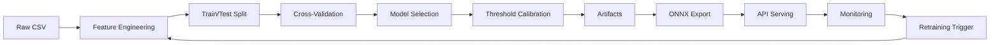

The ML system follows a structured five-stage lifecycle from data ingestion through production monitoring. Each stage produces versioned artifacts and maintains lineage tracking for reproducibility.

## Pipeline Overview

The lifecycle implements a systematic approach to building, deploying, and maintaining machine learning models:

1. **Data** - Load, validate, and version datasets
2. **Training** - Feature engineering, model selection, and calibration
3. **Optimization** - Benchmark performance and quantize for deployment
4. **Deployment** - Export to ONNX and serve predictions via API
5. **Monitoring** - Track drift and trigger retraining

## Stage 1: Data

Data ingestion loads raw datasets and applies feature engineering while tracking provenance.

### Data Loading

```python src/data.py
def load_dataset(config: dict) -> pd.DataFrame:
    data_path = config["data"]["path"]
    df = pd.read_csv(data_path)
    
    fcfg = FeatureConfig(
        epsilon=float(config["features"]["epsilon"]),
        minutes_watched_weight=float(config["features"]["engagement"]["minutes_watched_weight"]),
        days_on_platform_weight=float(config["features"]["engagement"]["days_on_platform_weight"]),
        courses_started_weight=float(config["features"]["engagement"]["courses_started_weight"]),
    )
    return add_engineered_features(df, fcfg)
```

### Feature Engineering

Engineered features combine raw inputs with domain knowledge:

```python src/features.py
def add_engineered_features(df: pd.DataFrame, cfg: FeatureConfig) -> pd.DataFrame:
    out = df.copy()
    
    out["engagement_score"] = (
        out["minutes_watched"] * cfg.minutes_watched_weight
        + out["days_on_platform"] * cfg.days_on_platform_weight
        + out["courses_started"] * cfg.courses_started_weight
    )
    
    out["exam_success_rate"] = np.where(
        out["practice_exams_started"] > 0,
        out["practice_exams_passed"] / (out["practice_exams_started"] + cfg.epsilon),
        0.0,
    )
    
    out["learning_consistency"] = out["minutes_watched"] / np.maximum(
        out["days_on_platform"], 1
    )
    
    return out
```

### Dataset Metadata

Dataset versions and schemas are tracked in `config/datasets.yaml`:

```yaml
ml_datasource:
  path: ml_datasource.csv
  target: purchased
  features:
    - student_country
    - days_on_platform
    - minutes_watched
    - courses_started
    - practice_exams_started
    - practice_exams_passed
```

## Stage 2: Training

Training orchestrates preprocessing, cross-validation, model selection, and threshold calibration.

### Model Training Pipeline

The training script (`src/train.py`) executes the full pipeline:

```python src/train.py
def main() -> None:
    config = load_config()
    set_global_seed(int(config["seed"]))
    
    df = load_dataset(config)
    X_train, X_test, y_train, y_test = split_data(df, config)
    
    preprocessor = build_preprocessor(X_train, config)
    models = build_models(config)
    
    # Cross-validation for model selection
    cv = StratifiedKFold(
        n_splits=int(config["cv"]["n_splits"]),
        shuffle=True,
        random_state=int(config["seed"]),
    )
    
    cv_rows = []
    trained = {}
    
    for name, model in models.items():
        pipe = Pipeline(steps=[("preprocessor", preprocessor), ("model", model)])
        scores = cross_validate(pipe, X_train, y_train, cv=cv, scoring=scoring)
        cv_rows.append({...})  # Store CV metrics
        pipe.fit(X_train, y_train)
        trained[name] = pipe
    
    # Select best model by ROC-AUC
    cv_df = pd.DataFrame(cv_rows).sort_values("cv_roc_auc_mean", ascending=False)
    best_model_name = cv_df.iloc[0]["model"]
    best_pipeline = trained[best_model_name]
```

### Threshold Calibration

Thresholds are calibrated to meet business precision targets:

```python src/train.py
probs = best_pipeline.predict_proba(X_test)[:, 1]
precisions, recalls, thresholds = precision_recall_curve(y_test, probs)
target_precision = float(config["business"]["target_precision"])

candidates = [i for i, p in enumerate(precisions[:-1]) if p >= target_precision]
if candidates:
    idx = max(candidates, key=lambda i: recalls[i])
else:
    idx = int(np.argmax(precisions[:-1]))

threshold = float(thresholds[idx])
```

### Training Outputs

Training produces versioned artifacts:

- `artifacts/best_model.joblib` - Serialized scikit-learn pipeline
- `artifacts/threshold.txt` - Calibrated decision threshold
- `artifacts/metrics.json` - Test set performance metrics
- `artifacts/lineage.json` - SHA256 hashes for reproducibility
- `artifacts/drift_baseline.json` - Training distribution statistics

## Stage 3: Optimization

Optimization measures performance characteristics and prepares models for deployment constraints.

### Statistical Benchmarking

The benchmark script (`benchmarking/statistical_benchmark.py`) measures latency distributions:

```bash
python benchmarking/statistical_benchmark.py
```

Outputs include:
- Repeated-run latency percentiles (p50, p95, p99)
- Quality metrics stability across runs
- Statistical confidence intervals

### Hardware-Aware Trade-offs

The trade-off experiments (`hardware_aware_ml/tradeoff_experiments.py`) quantify deployment options:

```bash
python hardware_aware_ml/tradeoff_experiments.py
```

Analyzes:
- Model size vs. inference latency
- Quantization impact on accuracy
- Memory footprint constraints

### ONNX Quantization

Models are quantized for deployment efficiency:

```bash
python deployment/quantize_onnx.py
```

Parity checks ensure quantization preserves quality:

```bash
python deployment/parity_check.py
```

See [ONNX Deployment](/deployment/onnx-export) for details.

## Stage 4: Deployment

Deployment exports trained models to portable formats and serves predictions via REST API.

### ONNX Export

Models are exported for cross-platform inference:

```bash
python deployment/export_onnx.py
```

Produces:
- `artifacts/model.onnx` - Portable model format
- `artifacts/model_quantized.onnx` - Quantized variant

### API Serving

The FastAPI service (`src/api.py`) provides prediction endpoints:

```python src/api.py
@app.post("/predict", response_model=PredictResponse)
def predict(payload: PredictRequest) -> PredictResponse:
    logger.info("Received /predict request")
    result = _predict_records([payload])[0]
    return result

@app.post("/batch_predict", response_model=BatchPredictResponse)
def batch_predict(payload: BatchPredictRequest) -> BatchPredictResponse:
    logger.info("Received /batch_predict request | records=%d", len(payload.records))
    results = _predict_records(payload.records)
    return BatchPredictResponse(predictions=results)
```

Start the server:

```bash
uvicorn src.api:app --host 0.0.0.0 --port 8000
```

## Stage 5: Monitoring

Monitoring tracks production inference patterns and detects distribution drift.

### Drift Detection

The API automatically tracks feature distributions:

```python src/api.py
with _LOCK:
    for col in numeric_cols:
        _MONITORING["feature_sums"][col] = _MONITORING["feature_sums"].get(col, 0.0) + float(feat_df[col].sum())
    _MONITORING["samples"] = int(_MONITORING["samples"]) + len(feat_df)
    _MONITORING["predicted_positive"] = int(_MONITORING["predicted_positive"]) + int(preds.sum())
```

### Drift Status Endpoint

Check for distribution drift:

```bash
curl http://localhost:8000/monitoring/drift
```

Response includes:
- `samples_observed` - Number of predictions
- `drift_score_max_abs_z` - Maximum z-score across features
- `drifted_features` - Features exceeding threshold
- `should_retrain` - Retraining recommendation

### Drift Thresholds

Configured in `config.yaml`:

```yaml
monitoring:
  prediction_log_file: artifacts/prediction_log.jsonl
  drift_min_samples: 50
  drift_zscore_threshold: 3.0
  drift_min_features: 2
  class_rate_shift_threshold: 0.1
```

### Prediction Logging

All predictions are logged to `artifacts/prediction_log.jsonl`:

```json
{
  "timestamp_utc": "2024-03-15T10:30:45.123456+00:00",
  "threshold": 0.6234,
  "predicted_purchase_probability": 0.7821,
  "predicted_purchase": 1,
  "features": {
    "student_country": "US",
    "days_on_platform": 45,
    "minutes_watched": 1230.5
  }
}
```

## Data Flow

Data flows through the system with versioning at each stage:



## Trade-offs and Failure Modes

<AccordionGroup>
  <Accordion title="Latency vs Accuracy">
    Quantized artifacts reduce latency by 40-60% but may shift accuracy by 1-2%. Parity checks enforce maximum degradation thresholds.
  </Accordion>
  
  <Accordion title="Throughput vs Queue Delay">
    Streaming worker scaling improves throughput but can increase request contention. Load testing quantifies the trade-off space.
  </Accordion>
  
  <Accordion title="Portability vs Feature Completeness">
    ONNX export improves cross-platform portability but may not support all scikit-learn operators. Unsupported ops require custom conversion.
  </Accordion>
  
  <Accordion title="Failure Modes">
    Release blockers include:
    - Parity drift exceeding tolerance
    - Schema mismatch between training and serving
    - Queue saturation under load
    - Missing lineage artifacts
  </Accordion>
</AccordionGroup>

## Assumptions and Limitations

<Note>
The workflow assumes:
- Stable feature names across training and serving
- Statistical confidence intervals depend on run count
- Hardware counters may be unavailable on restricted hosts
</Note>

## Related Documentation

- [Reproducibility Mechanisms](/concepts/reproducibility)
- [Configuration System](/concepts/configuration)
- [ONNX Deployment Overview](/deployment/overview)
- [API Reference](/api-reference/health)
