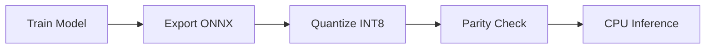

## Workflow Stages

The deployment pipeline converts trained scikit-learn models into optimized ONNX artifacts for production inference:



### 1. Model Training

Produce the baseline scikit-learn artifact:

```bash
python -m src.train
```

**Outputs:**
- `artifacts/best_model.joblib` - trained pipeline
- `artifacts/threshold.txt` - optimal decision threshold
- `artifacts/lineage.json` - experiment metadata

### 2. ONNX Export

Convert scikit-learn model to ONNX format:

```bash
python deployment/export_onnx.py
```

**Outputs:**
- `artifacts/model.onnx` - portable ONNX graph
- `artifacts/onnx_features.json` - feature schema
- `artifacts/onnx_metadata.json` - threshold and provenance

### 3. INT8 Quantization

Apply dynamic quantization for reduced memory and latency:

```bash
python deployment/quantize_onnx.py
```

**Outputs:**
- `artifacts/model.int8.onnx` - quantized model

### 4. Parity Validation

Verify numerical agreement between scikit-learn and ONNX:

```bash
python deployment/parity_check.py --abs-tol 0.04 --mean-tol 0.01
```

**Outputs:**
- `artifacts/parity_report.json` - validation metrics
- Exit code 0 if passed, 1 if failed

### 5. Performance Benchmarking

Measure inference latency and throughput:

```bash
python deployment/cpu_inference.py --backend sklearn
python deployment/cpu_inference.py --backend onnx
```

## Artifact Dependencies

<Accordion title="Dependency Graph">

```
config.yaml
└── src.train
    ├── artifacts/best_model.joblib
    ├── artifacts/threshold.txt
    └── artifacts/lineage.json
        └── export_onnx.py
            ├── artifacts/model.onnx
            ├── artifacts/onnx_features.json
            └── artifacts/onnx_metadata.json
                ├── quantize_onnx.py
                │   └── artifacts/model.int8.onnx
                ├── parity_check.py
                │   └── artifacts/parity_report.json
                └── cpu_inference.py
```

</Accordion>

## Backend Selection Guide

<CardGroup cols={3}>
  <Card title="scikit-learn" icon="python">
    **Use when:**
    - Development and experimentation
    - Python-native environment
    - No latency constraints
    
    **Trade-offs:**
    - Requires full Python stack
    - Larger memory footprint
    - Slower inference
  </Card>
  
  <Card title="ONNX" icon="cube">
    **Use when:**
    - Cross-platform deployment
    - C++/C# production services
    - Moderate latency requirements
    
    **Trade-offs:**
    - Operator support limitations
    - Conversion complexity
    - Requires parity validation
  </Card>
  
  <Card title="Quantized ONNX" icon="microchip">
    **Use when:**
    - Edge/mobile deployment
    - Memory-constrained environments
    - Latency-critical applications
    
    **Trade-offs:**
    - Potential accuracy degradation
    - INT8 precision limits
    - Must verify prediction margins
  </Card>
</CardGroup>

## Design Trade-offs

<Warning>
**ONNX Export** improves runtime portability but introduces conversion compatibility risk. Models using custom transformers or unsupported operators may fail.
</Warning>

<Warning>
**Quantization** can lower memory (2-4x) and latency (1.5-2x) but may alter prediction margins near the decision threshold.
</Warning>

<Warning>
**Tight parity thresholds** reduce silent regressions but increase release friction. Tune `--abs-tol` and `--mean-tol` based on business impact of prediction drift.
</Warning>

## Common Failure Modes

| Issue | Cause | Mitigation |
|-------|-------|------------|
| **Missing operator support** | skl2onnx doesn't cover all sklearn transformers | Use supported pipeline components or implement custom converter |
| **Parity failure** | Preprocessing mismatch or float32 vs float64 precision | Inspect feature distributions, check categorical encoding |
| **Runtime package drift** | Different ONNX Runtime versions between dev and prod | Pin `onnxruntime` version in requirements.txt |
| **Quantization accuracy drop** | Model relies on precise float values near threshold | Widen tolerance or skip quantization for critical features |

## Assumptions and Limitations

<Info>
- Workflow targets **CPU execution** with ONNX Runtime CPU provider
- Model contract assumes **stable feature ordering** and preprocessing semantics
- Parity thresholds should be **re-tuned** when feature engineering changes materially
- Quantization applies to weights only (dynamic quantization), not activations
</Info>

## Next Steps

<CardGroup cols={2}>
  <Card title="ONNX Export" icon="file-export" href="/deployment/onnx-export">
    Learn how to convert scikit-learn models to ONNX format
  </Card>
  <Card title="Quantization" icon="compress" href="/deployment/quantization">
    Optimize models with INT8 dynamic quantization
  </Card>
  <Card title="Parity Validation" icon="check-double" href="/deployment/parity-validation">
    Validate numerical agreement between backends
  </Card>
</CardGroup>